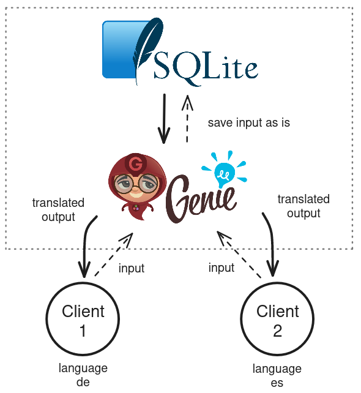

# Translator Chat

## Intro

This project is a chat-prototype written in the Julia language. All inputs are shared on a common window.
Users can choose the language to which they want the entire chat to be translated to. This translation is done with the Google Translate API.

## Architecture

Users of a chat may want to communicate in their respective native languages. Their input is saved, translated to english as a transatory step and then saved
to the PostgreSQL database.

The output is created by the application translating the english text back to the selected language of the user. User 1 will have their chat
completely in German, while User 2 will have it in Spanish.

## Starting Points

